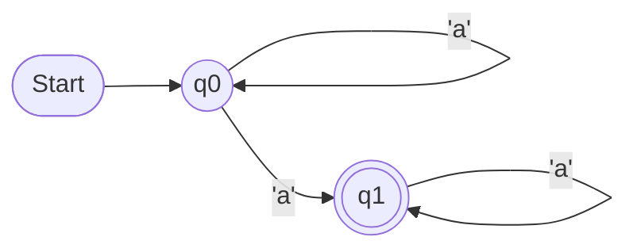

# Subset of piazza discussions
## @25 - Jaffe's n
We were discussing whether the minimal $n$ that makes Jaffe’s lemma true for a regular language $L$ is equal to the size of the minimal automata of 
$L$. This turns out to be false, but is there any relation between the two?

Edit 1: it seems to neither be the size of minimal DFA nor NFA although the latter comes closer.

This discussion was resolved in Quiz 1 qn 2, and in lec10. jp <= sc, where jp is the minimum n where jaffe's pumping lemma becomes true, and sc is the size of the minimal automata = number of classes induced by the myhill nerode relation of the language.

## @26 Myhill-Nerode for NFA
The Myhill-Nerode theorem is for a DFA but in some languages there can be exponential difference between minimal DFA and NFA. So is there an analogue of Myhill-Nerode for an NFA?

Sadly, no ;/

## @35 Star-free languages
Are all regular languages star-free, if yes, then what's the proof and if no, what's the counter example?

- In the quiz we saw that $(ab)^*$ is star-free, and so is $\Sigma^*$. Can you try to write down $(aa)^*$ as a star-free expression?

## @33 and @36 - Subword pumping lemma not being iff
(check out lec10 first ;-;)

@33:

Let's define a language on the alphabet $\Sigma$ = {0 , 1, 2, 3}

$L = L_1 \vee L_2$
where $L_1 = $ {words having exactly ${\frac{1}{7}}^{th}$ of the total size number of letters as 3 }

$L_2 = $ {words where atleast one continuous substring of length 3 has 2 or more letters matching}

Claim : L is not regular

Take $L \land (012)^*(3012)^*$

This intersection has no element of $L_2$. The intersection comes out to be $(012)^m(3012)^m$, which is not regular

Claim : $L$ satisfies the subword pumping lemma

Taking the pumping length to be 5. By PHP our subword must have atleast one letter repeating

Case-1 : XX or XAX form repetitions

Clearly, we can take y from the remaining letters and pump. For all values of i this case will be accepted

Case-2: XABX or XABCX

We can pump AB as y.

If we pump down XX / XCX will give us acceptance into L

If we pump up ABAB substring gives us acceptance into L.

Hence this case also satisfies subword pumping lemma.

@33 also has a proof for the example in slides, claiming that p=3 satisfies it and not p=2.

@36:
As some people have given examples of non regular languages that satisfy subword pumping.

I was thinking that the reason of subword not being iff would be that the statement only talks about one direction. Given a word in language, all subword pumpings also are in the language. But not what happens if the word is not in the language. So languages where we can't pump out but can pump in end up being counterexamples.

So maybe a lemma that uses double implication instead of single could be iff?

## @39 - Reversal Minimization of DFA
In last year’s logic midsem, we had this minimization procedure using reversing the arrows and determinizing the automata. How can we prove correctness of that procedure?

If automaton A is reversed (via NFA and subset constr) to A’, then A’ is minimal. 

to see this, assume two states p and q in A’ were equivalent. This means there is no distinguishing suffix in A’. each suffix of A’ correspondence to a partial run of A, ie a state of A (A is dfa). no distinguishing suffix between p and q means that p and q contain the same states of A which means they are the same state, a contradiction. 

Now use this again to get back minimal automaton for L(A).

## @42 - Atleast One Run, All Runs, What's Next, Odd Number of Runs?
After the discussion about different accepting conditions based on runs, my friend randomly came upon an idea of an NFA, but the acceptance condition being Odd number of runs are accepting.

Funnily enough, The languages accepted are still all regular.

The reasoning behind this surprisingly nice, and it opens up an interesting way to keep track of runs in a way different from subset of states., and thought it is worth a discussion on piazza.

(??? I don't get it ;-; I didn't get the follow ups either T\_T)

- How about a prime number of runs should be accepting? What happens then?

The above NFA has n accepting runs for $a^n$, so it accepts a^primes according to the above accepting condition. So the languages accepted by the nfa with the new acceptance conditions are not all regular.

- Let us show that the condition "Accept a word $w$ iff the number of accepting runs is divisible by $k$" leads to a regular language $L_k(A)$ for an automata $A$ which does not have $\epsilon$ transitions.

Consider a new automata with states in $\{0,1,...,k-1\}^Q$, i.e a set of $|Q|$ tuples of the form $(q_i, r_i)$, where $r_i$ denotes the number of runs ending in $q_i$ modulo $k$, which can also be thought of as a function $Q \rightarrow \{0,...,k-1\}$. The initial state will be the function $f(q) = 1 \text{ if } q = q_0 \text{ else } 0$

Now let us assume we are in state $f$ and get the alphabet $a$. Consider the state $q_i$. The number of runs to $q_i$ are $f(q_i)$ currently. If $\delta(q_i,a) = \{q_i^1,...,q_i^t\}$ then in the next states, we should increment $f(q_i^j)$ by $f(q_i)$ for $ 1 \le j \le t$. Formally, call the new transition function $\delta '$. Then $\delta '(f,a) : Q \rightarrow \{0,...,k-1\}$ defined by  $\delta '(f,a)(q_a) := \sum_{i=0}^{|Q|-1} (f(q_i) \text{ if } q_a \in \delta(q_i,a) \text{ else } 0) mod k$

The final states will be all functions $f$ such that $\sum_{q \in F} f(q)$ is divisible by $k$. This is a DFA with $k^{|Q|}$ states that accepts words with number of accepting runs divisible by $k$.

Important Note: We should remove all $\epsilon$ transitions beforehand otherwise there can be infinitely many accepting runs.

## @45 - Exact blowup NFA

```mermaid
flowchart LR
    Start([Start]) --> q0((1))
    q0 -- "b" --> q0
    q0 -- "a" --> q1((2))
    q1 -- "&#931;" --> d0[...]
    d0 -- "&#931;" --> q2((n-1))
    q2 -- "&#931;" --> q3(((n)))
    q3 -- "a" --> q0
    q3 -- "a" --> q1
```

Consider the above automata. If $q_0 = \textbf{1}$ and $F = \{\textbf{n}\}$ then an NFA -> DFA conversion in the above automata causes exactly $2^n$ blowup. I was wondering if the two back transitions from $\textbf{n}$ are necessary? It seems we can still visit all subsets even if they are removed.

Edit: I think I see it, we would only be able to visit singleton subsets otherwise. It would seem this is the minimal automata with the Exact blowup property.

## @48 and @49 - Tut4, Question1
@48: An AFA which has $n+1$ states, has a loop back to start state, and accepts $a^n$
$Q = \{q_0, q_1, ..., q_n\}$ with start state $q_0$, accepting states F = $\{q_n\}$ and $\delta (q_i,a) = \text{ if } 0 \le i \lt n, q_{i+1} \text{ else if } i=n, q_0 \land q_n$ 

Words shorter than n end at a non final state, and $a^n$ ends at $q_n$, for any longer word there is a branch which stays at $q_n$ until the last letter and then moves to $q_0$ thereby being rejected.

@49: Sub linear AFA for $a^n$
(??? help)
We will show that there exists an AFA of size $\tilde{O}(\sqrt{n})$ for $n = p_1...p_k$ where $p_1, p_2, ..., p_k$ are the first $k$ primes conditional on some number-theoretic conjectures. There is an unconditional argument for $O(\frac{n}{log(n)})$. We use the notation $f ~ g$ to denote $f = O(g)$ and outline the general idea below.

So the starting state is a $\forall$-state and we can add constraints of the form $p_i | n$ for $1\lt i \lt k$. This leads to $\sum_{i=1}^k p_i ~ k^2logk$ states and we know that $n ~ exp(c_1klogk)$ therefore,
$klogk ~logn \implies k ~ \frac{logn}{loglogn} 
 so the number of states added is $O(\frac{log^2n}{loglogn})$.

Now we need a way of eliminating acceptance of $a^m$ for $m \ge n+1$. For this, we appeal to the Frobenius Problem which says that given two coprime integers $A$ and $B$ the largest $f$ that cannot be represented in the form $aA+bB$ for $a,b \ge 0$ is $AB-A-B$
Consider the NFA whose initial state has an $\epsilon$-transition to an $A$-cycle and then one (initial) vertex of this $A$-cycle has an $\epsilon$-transition to a $B$-cycle. Finally the one (initial) vertex of this $B$-cycle has an $\epsilon$ transition to an accepting final state with no outgoing transitions. This encodes the Frobenius problem in $A+B+2$ states. Therefore, interpreting the NFA as an AFA, we can encode the complement of the Frobenius problem in $A+B+2$ states. Actually we have a small family of Frobenius problems embedded and we can assume that the largest number that the automata will accept is exactly $AB-A-B+c$ for some absolute constant integer $c$. If $c=0$ then the above construction works verbatim. If $c \gt 0$ then we add some buffer states before the first cycle and if $c \lt 0$ then we can skip some states when we move from the initial state to the $A$-cycle for large $A,B$.

Now the remainder is a number theory problem and I have attached a proof that I could generate from gemini by injecting ideas. Basically we need to show that we can take the $A, B$ in the Frobenius problem to be $~\sqrt{p_1 ... p_k}$ upto a logarithmic factor which completes the proof.

Unfortunately this shows that the “proof” that we did for Q1 in Tutorial 4 yesterday is incorrect. However that proof works for normal NFAs at least.

## @50 - Empty Stack DPDA
I was thinking about making a DPDA which accepts by empty stack for the a^n b^n example, as we had a problem accepting the empty word.

Then I realized I think this problem extends to any language that has a word other than the empty word and the empty word itself.

As we need to accept the empty word by emptying the stack, there needs to be a transition which accepts (some state, empty word, bottom) and makes it (some state, empty stack).

Now, to accept the empty word, this some state must be reached only with empty word transitions.

> if $|\delta(q,a,X)| = 1$ for some $a \in \Sigma$, then $|\delta(q,\epsilon,X)| = 0$

Now, because of the above rule, for a specific state and stack configuration, either only an empty word transition exists or it doesn't (so if an empty word transition exists for a configuration, it's forced).

Doesn't that mean recursively we can argue every single epsilon transition taken was forced, and through this we can argue the whole run on the DPDA was forced, so if any DPDA (that accepts by empty stack) accepts the empty word, the empty word run will be forced, and hence it can only accept the empty word in that case?

- Yeah, if you have a DPDA by empty stack accepting $\epsilon$, that’s all it can accept, given the initial ($q_0, \bot$ initial stack symbol) combination.

- As briefly discussed by ma'am, this argument can further be extended for all languages that are not prefix-free. A language that is not prefix-free can't be captured by a DPDA with the empty stack acceptance because of similar reasoning as once we read the prefix and have empty stack (because it is accepting), we can't extend the word further. Intuitively, I believe that given the constraint that the language is prefix-free, then both the acceptance should be equivalent and pretty much the same proof we discussed for NPDAs will work here as well. The only step we need to change in the proof is from the final state acceptance to empty stack acceptance proof, where we were clearing the stack from the final state, we need to add one more argument as the language is prefix free, if I am at a final state, any transition I make will take me to a state from which all final states are non-reachable, thus I can remove any such transition from final state (as it is not required by DPDA to be complete (I don't know if complete is the correct terminology here)). After this, I can add a self-loop on final states to empty the stack. Note that here we won't even need to first take an epsilon transition to a new state and then pop, adding a self-loop is safe in this scenario